## 2.4 Quay Registry Configuration. 
 
Install podman and container-selinux packages for standalone registry

    [root@reg01 mirror]# yum module install container-tools:4.0 -y
    Updating Subscription Management repositories.
    Last metadata expiration check: 0:25:01 ago on Wednesday 24 January 2024 07:23:16 PM IST.
    Dependencies resolved.
    The operation would result in switching of module 'container-tools' stream 'rhel8' to stream '4.0'
    Error: It is not possible to switch enabled streams of a module unless explicitly enabled via configuration option module_stream_switch.
    It is recommended to rather remove all installed content from the module, and reset the module using 'yum module reset <module_name>' command. After you reset the module, you can install the other stream.

Reset the yum module container-tools. 

    [root@reg01 mirror]# yum module reset container-tools
    Updating Subscription Management repositories.
    Last metadata expiration check: 0:25:18 ago on Wednesday 24 January 2024 07:23:16 PM IST.
    Dependencies resolved.
    ========================================================================================================================================================================================
     Package                                     Architecture                               Version                                       Repository                                   Size
    ========================================================================================================================================================================================
    Resetting modules:
     container-tools
    
    Transaction Summary
    ========================================================================================================================================================================================
    
    Is this ok [y/N]: y
    Complete!
 
Install Container-tools module package bundle. 
   
    [root@reg01 ~]# yum module install container-tools:4.0
    Updating Subscription Management repositories.
    Last metadata expiration check: 0:26:35 ago on Wednesday 24 January 2024 07:23:16 PM IST.
    Dependencies resolved.
    =====================================================================================================================================================
     Package                             Architecture   Version                                           Repository                                Size
    =====================================================================================================================================================
    Upgrading:
     container-selinux                   noarch         2:2.205.0-3.module+el8.9.0+20656+56f336b9         rhel-8-for-x86_64-appstream-rpms          63 k
     containernetworking-plugins         x86_64         1:1.1.1-6.module+el8.9.0+20875+8dd9d5d2           rhel-8-for-x86_64-appstream-rpms          19 M
     criu                                x86_64         3.15-3.module+el8.9.0+20656+56f336b9              rhel-8-for-x86_64-appstream-rpms         518 k
     fuse-overlayfs                      x86_64         1.9-2.module+el8.9.0+20656+56f336b9               rhel-8-for-x86_64-appstream-rpms          74 k
     libnftnl                            x86_64         1.2.2-3.el8                                       rhel-8-for-x86_64-baseos-rpms             87 k
     libslirp                            x86_64         4.4.0-1.module+el8.9.0+20656+56f336b9             rhel-8-for-x86_64-appstream-rpms          70 k
     nftables                            x86_64         1:1.0.4-3.el8_9                                   rhel-8-for-x86_64-baseos-rpms            380 k
     python3-nftables                    x86_64         1:1.0.4-3.el8_9                                   rhel-8-for-x86_64-baseos-rpms             31 k
     runc                                x86_64         1:1.1.5-2.module+el8.9.0+20656+56f336b9           rhel-8-for-x86_64-appstream-rpms         3.1 M
    Installing group/module packages:
     crun                                x86_64         1.8.7-1.module+el8.9.0+20656+56f336b9             rhel-8-for-x86_64-appstream-rpms         238 k
     python3-podman                      noarch         4.0.0-2.module+el8.9.0+20656+56f336b9             rhel-8-for-x86_64-appstream-rpms         149 k
     skopeo                              x86_64         2:1.6.2-9.module+el8.9.0+20656+56f336b9           rhel-8-for-x86_64-appstream-rpms         6.6 M
     toolbox                             x86_64         0.0.99.4-5.module+el8.9.0+20656+56f336b9          rhel-8-for-x86_64-appstream-rpms         2.5 M
     udica                               noarch         0.2.6-4.module+el8.9.0+20656+56f336b9             rhel-8-for-x86_64-appstream-rpms          49 k
    Installing dependencies:
     python3-pytoml                      noarch         0.1.14-5.git7dea353.el8                           rhel-8-for-x86_64-appstream-rpms          25 k
    Installing weak dependencies:
     criu-libs                           x86_64         3.15-3.module+el8.9.0+20656+56f336b9              rhel-8-for-x86_64-appstream-rpms          38 k
    Downgrading:
     buildah                             x86_64         1:1.24.6-7.module+el8.9.0+20656+56f336b9          rhel-8-for-x86_64-appstream-rpms         8.0 M
     cockpit-podman                      noarch         46-1.module+el8.9.0+20656+56f336b9                rhel-8-for-x86_64-appstream-rpms         501 k
     conmon                              x86_64         2:2.1.4-2.module+el8.9.0+20656+56f336b9           rhel-8-for-x86_64-appstream-rpms          56 k
     containers-common                   x86_64         2:1-38.module+el8.9.0+20656+56f336b9              rhel-8-for-x86_64-appstream-rpms         106 k
     podman                              x86_64         2:4.0.2-25.module+el8.9.0+20875+8dd9d5d2          rhel-8-for-x86_64-appstream-rpms          13 M
     podman-catatonit                    x86_64         2:4.0.2-25.module+el8.9.0+20875+8dd9d5d2          rhel-8-for-x86_64-appstream-rpms         356 k
     slirp4netns                         x86_64         1.1.8-3.module+el8.9.0+20656+56f336b9             rhel-8-for-x86_64-appstream-rpms          51 k
    Installing module profiles:
     container-tools/common
    Enabling module streams:
     container-tools                                    4.0
    
    Transaction Summary
    =====================================================================================================================================================
    Install    7 Packages
    Upgrade    9 Packages
    Downgrade  7 Packages
    
    Total download size: 55 M
    Is this ok [y/N]: y

Check podman and buildah version needed for Quay Mirror Registry as it needs podman version greater than 3.0

    [root@reg01 ~]# skopeo -v
    skopeo version 1.6.2-maint

    [root@reg01 ~]# podman version
    Client:       Podman Engine
    Version:      4.0.2
    API Version:  4.0.2
    Go Version:   go1.20.6
    Built:      Thu Dec  7 14:33:52 2023
    OS/Arch:    linux/amd64

    [root@reg01 ~]# systemctl enable --now podman.socket podman.service
    Created symlink /etc/systemd/system/sockets.target.wants/podman.socket → /usr/lib/systemd/system/podman.socket.
    Created symlink /etc/systemd/system/default.target.wants/podman.service → /usr/lib/systemd/system/podman.service.

## Install the Quay Mirror Registry

   
Listing block disk [Add raw disk (sda)]

    [root@reg01 ~]# lsblk
    NAME          MAJ:MIN RM  SIZE RO TYPE MOUNTPOINT
    sda             8:0    0  780G  0 disk 
    sr0            11:0    1 11.3G  0 rom  /run/media/root/RHEL-8-7-0-BaseOS-x86_64
    nvme0n1       259:0    0  560G  0 disk 
    ├─nvme0n1p1   259:1    0    1G  0 part /boot/efi
    ├─nvme0n1p2   259:2    0    1G  0 part /boot
    └─nvme0n1p3   259:3    0  558G  0 part 
      ├─rhel-root 253:0    0  555G  0 lvm  /
      └─rhel-swap 253:1    0    3G  0 lvm  [SWAP]

Make filesystem. 

    [root@reg01 ~]# mkfs.xfs /dev/sda 
    meta-data=/dev/sda               isize=512    agcount=4, agsize=51118080 blks
             =                       sectsz=512   attr=2, projid32bit=1
             =                       crc=1        finobt=1, sparse=1, rmapbt=0
             =                       reflink=1    bigtime=0 inobtcount=0
    data     =                       bsize=4096   blocks=204472320, imaxpct=25
             =                       sunit=0      swidth=0 blks
    naming   =version 2              bsize=4096   ascii-ci=0, ftype=1
    log      =internal log           bsize=4096   blocks=99840, version=2
             =                       sectsz=512   sunit=0 blks, lazy-count=1
    realtime =none                   extsz=4096   blocks=0, rtextents=0
    
Create a mount directory. 
    
    [root@reg01 ~]# mkdir /ocpregistry 

temporary mount 
    
    [root@reg01 ~]# mount /dev/sda /ocpregistry/ -v
    mount: /dev/sda mounted on /ocpregistry.

persistent mount disk. 
    
    [root@reg01 ~]# echo "/dev/sda /ocpregistry xfs defaults 0 0" >> /etc/fstab 
    

Create a mirror directory for quay registry. 

    [root@reg01 ~]# mkdir  /ocpregistry/mirror 

    [root@reg01 ocpregistry]# ls
    mirror-registry.tar.gz 
    [root@reg01 ~]# cd /ocpregistry/mirror

Extract mirror-registry.tar.gz to ocpregistry directory. 

    [root@reg01 mirror]# tar xf mirror-registry.tar.gz -C /ocpregistry/mirror 

Install quay Mirror Registry 

    [root@reg01 mirror]# ./mirror-registry install --quayHostname reg01.ocp4.example.com --quayStorage /ocpregistry/mirror --quayRoot /ocpregistry/mirror --initUser root --initPassword r3dh4t1! 
       __   __
      /  \ /  \     ______   _    _     __   __   __
     / /\ / /\ \   /  __  \ | |  | |   /  \  \ \ / /
    / /  / /  \ \  | |  | | | |  | |  / /\ \  \   /
    \ \  \ \  / /  | |__| | | |__| | / ____ \  | |
     \ \/ \ \/ /   \_  ___/  \____/ /_/    \_\ |_|
      \__/ \__/      \ \__
                      \___\ by Red Hat
     Build, Store, and Distribute your Containers
    
    INFO[2024-01-24 19:56:24] Install has begun
    INFO[2024-01-24 19:56:24] Found execution environment at /ocpregistry/mirror/execution-environment.tar 
    INFO[2024-01-24 19:56:24] Loading execution environment from execution-environment.tar 
    INFO[2024-01-24 19:56:28] Detected an installation to localhost        
    INFO[2024-01-24 19:56:28] Did not find SSH key in default location. Attempting to set up SSH keys. 
    INFO[2024-01-24 19:56:28] Generating SSH Key
    INFO[2024-01-24 19:56:28] Generated SSH Key at /root/.ssh/quay_installer 
    INFO[2024-01-24 19:56:28] Adding key to ~/.ssh/authorized_keys
    INFO[2024-01-24 19:56:28] Successfully set up SSH keys
    INFO[2024-01-24 19:56:28] Attempting to set SELinux rules on /root/.ssh/quay_installer 
    WARN[2024-01-24 19:56:28] Could not set SELinux rule. If your system does not have SELinux enabled, you may ignore this. 
    INFO[2024-01-24 19:56:28] Found image archive at /ocpregistry/mirror/image-archive.tar 
    INFO[2024-01-24 19:56:28] Detected an installation to localhost        
    INFO[2024-01-24 19:56:28] Unpacking image archive from /ocpregistry/mirror/image-archive.tar 
    ...

    INFO[2024-01-24 20:00:42] Quay installed successfully, config data is stored in /ocpregistry/mirror
    INFO[2024-01-24 20:00:42] Quay is available at https://reg01.ocp4.example.com:8443 with credentials (root, ######!)
    

Certificate pem directory placement.

    [root@reg01 mirror]# cp /ocpregistry/mirror/quay-rootCA/rootCA.pem /etc/pki/ca-trust/source/anchors/
    [root@reg01 mirror]# update-ca-trust 

Quay login testing 

    [root@reg01 ~]# podman login reg01.ocp4.example.com:8443
    Username: root
    Password: 
    Login Succeeded!

Extract pull-secret from quay mirror registry. 

    [root@reg01 ~]# podman login reg01.ocp4.example.com:8443 --authfile quay-secret.json
    Username: root
    Password: 
    Login Succeeded!
    
    [root@reg01 ~]# ls quay-secret.json 
    quay-secret.json

Oneview result of quay-secret.json 
    
    [root@reg01 ~]# cat quay-secret.json | jq . -c 
    {"auths":{"reg01.ocp4.example.com:8443":{"auth":"Zml<REDACTED>R0MSE="}}}

    [root@reg01 ~]# mkdir .docker 
    [root@reg01 ~]# cp quay-secret.json .docker/config

Setting up variables requirements for ocp images

    [root@reg01 ~]# vim openshift-vars.sh 
    export OCP_RELEASE=4.15.0
    export LOCAL_REGISTRY=reg01.ocp4.example.com:8443
    export LOCAL_REPOSITORY=ocp4/openshift4
    export REG_CREDS=/root/quay-secret.json
    export PRODUCT_REPO=openshift-release-dev
    export RELEASE_NAME=ocp-release
    export ARCHITECTURE=x86_64
    export GODEBUG=x509ignoreCN=0
    export REMOVABLE_MEDIA_PATH=/ocpregistry/ocp-base-images

    [root@reg01 ~]# source openshift-vars.sh 
    
    [root@reg01 ~]# echo $LOCAL_REGISTRY
    reg01.ocp4.example.com:8443

Quay Login Dashboard. 

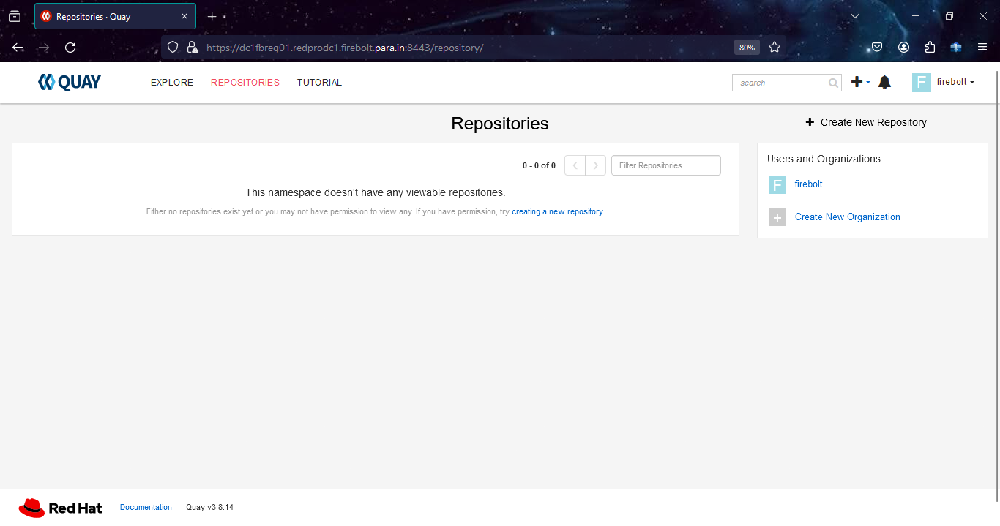

## 2.3. Mirror OCP 4.15 Images to Quay Mirror Registry

Download and Install oc-mirror cli command line tool to use the plugin to download images.

    [root@reg01 ~]# chmod a+x /usr/bin/oc-mirror
    [root@reg01 ~]# oc-mirror version
    Logging to .oc-mirror.log
    Client Version: version.Info{Major:"", Minor:"", GitVersion:"4.15.0-202402082307.p0.gcae37aa.assembly.stream.el8-cae37aa", GitCommit:"cae37aa25d9d96bdedcee45e659188a644f78a58", GitTreeState:"clean", BuildDate:"2024-02-09T00:49:20Z", GoVersion:"go1.20.12 X:strictfipsruntime", Compiler:"gc", Platform:"linux/amd64"}

Pushing OCP-Base-Images

> [!NOTE]
> If Internet is available on registry node, download the ocp-base-images. 

    [root@reg01 ~]# oc adm release mirror -a ${LOCAL_SECRET_JSON} --from=quay.io/${PRODUCT_REPO}/${RELEASE_NAME}:${OCP_RELEASE}-${ARCHITECTURE} --to=${LOCAL_REGISTRY}/${LOCAL_REPOSITORY} --to-release-image=${LOCAL_REGISTRY}/${LOCAL_REPOSITORY}:${OCP_RELEASE}-${ARCHITECTURE}

    info: Mirroring 192 images to reg01.ocp4.example.com:8443/ocp4/openshift4 ...
    reg01.ocp4.example.com:8443/
    ocp4/openshift4
        blobs:
        quay.io/openshift-release-dev/ocp-release sha256:87149a90e18edbe09c01b9bf2f15859d4b6afe8c0611ddc89e452d69bee43f9e 1.644KiB
        quay.io/openshift-release-dev/ocp-release sha256:4d802854a4401e6cb61ee90052f279f915ad6cf3e59ee0041af8be28b2f19140 1.084MiB
        quay.io/openshift-release-dev/ocp-release sha256:13c9a347b47c4b1b110976860d7000e2e90960634bea697084bb29eedfad9723 9.816MiB
        quay.io/openshift-release-dev/ocp-release sha256:274bab76cbe05f281ec31b4ce59c793dd7f16b92b1e1d6903e434d8b7623118d 27.02MiB
        quay.io/openshift-release-dev/ocp-release sha256:d1c21e1bfa894728d42734714da3eaee019f4ce77581d9fb20e04322491b1a9a 40.47MiB
        quay.io/openshift-release-dev/ocp-release sha256:ca1636478fe5b8e2a56600e24d6759147feb15020824334f4a798c1cb6ed58e2 74.55MiB
        blobs:
        quay.io/openshift-release-dev/ocp-v4.0-art-dev sha256:d8190195889efb5333eeec18af9b6c82313edd4db62989bd3a357caca4f13f0e 1.404KiB
        quay.io/openshift-release-dev/ocp-v4.0-art-dev sha256:9e3b9394c6e8df6448c6d45d649b531bfb5185e4d349abf8426717f0469085c1 2.17KiB

        info: Mirroring completed in 36m4.05s (9.088MB/s)

    Success
    Update image:  reg01.ocp4.example.com:8443/ocp4/openshift4:4.15.0-x86_64
    Mirror prefix: reg01.ocp4.example.com:8443/ocp4/openshift4
    Mirror prefix: reg01.ocp4.example.com:8443/ocp4/openshift4:4.15.0-x86_64

    To use the new mirrored repository to install, add the following section to the install-config.yaml:

    imageContentSources:
    - mirrors:
    - reg01.ocp4.example.com:8443/ocp4/openshift4
    source: quay.io/openshift-release-dev/ocp-release
    - mirrors:
    - reg01.ocp4.example.com:8443/ocp4/openshift4
    source: quay.io/openshift-release-dev/ocp-v4.0-art-dev

    To use the new mirrored repository for upgrades, use the following to create an ImageContentSourcePolicy:

    apiVersion: operator.openshift.io/v1alpha1
    kind: ImageContentSourcePolicy
    metadata:
    name: example
    spec:
    repositoryDigestMirrors:
    - mirrors:
        - reg01.ocp4.example.com:8443/ocp4/openshift4
        source: quay.io/openshift-release-dev/ocp-release
    - mirrors:
        - reg01.ocp4.example.com:8443/ocp4/openshift4
        source: quay.io/openshift-release-dev/ocp-v4.0-art-dev

    [root@reg01 ~]# oc adm release extract -a ${LOCAL_SECRET_JSON} --command=openshift-install "${LOCAL_REGISTRY}/${LOCAL_REPOSITORY}:${OCP_RELEASE}-${ARCHITECTURE}"

    [root@reg01 ~]# openshift-install version
    openshift-install 4.15.0
    built from commit e8c70b7db9e64cafa7fe3182c365257c3e53fbb6
    release image quay.io/openshift-release-dev/ocp-release@sha256:0da6316466d60a3a4535d5fed3589feb0391989982fba59d47d4c729912d6363
    release architecture amd64
    

Listing Operators after pushed in Quay registry.

## 3. Installing a OpenShift Cluster in a Disconnected Network on Baremetal Machines

3.1. Installing a OpenShift Cluster Setup.

Generating an SSH private key and adding it to the agent

    [root@reg01 ~]# ssh-keygen -t ed25519 -N ''
    Generating public/private ed25519 key pair.
    Enter file in which to save the key (/root/.ssh/id_ed25519):
    Created directory '/root/.ssh'.
    Your identification has been saved in /root/.ssh/id_ed25519.
    Your public key has been saved in /root/.ssh/id_ed25519.pub.
    The key fingerprint is:
    SHA256:z3mXx9Pe/hPC6dCkVtQB3NOc05NqoxTVnysV+OSAD6I root@reg01.ocp4.example.com
    The key's randomart image is:
    +--[ED25519 256]--+
    |            +o*o*|
    |         . + = %+|
    |        . . = * B|
    |       E   . B =.|
    |        S . O + .|
    |         o * * =.|
    |          = + =.=|
    |           . o +o|
    |               .B|
    +----[SHA256]-----+
    
    [root@reg01 ~]# cat .ssh/id_ed25519.pub 
    ssh-ed25519 AAAAC3NzaC1{<REDACTED>}DIUeZJkdjTaMRkzn root@reg01.ocp4.example.com
    
Manually creating the installation configuration file

    [root@reg01 ocp4]# cat install-config.yaml 
    apiVersion: v1
    baseDomain: root.para.in
    compute:
      - hyperthreading: Enabled
        name: worker 
        replicas: 0 
    controlPlane:
      hyperthreading: Enabled
      name: master
      replicas: 3
    metadata:
      name: redprodc1 
    networking:
      clusterNetwork:
        - cidr: 10.128.0.0/14
          hostPrefix: 23
      networkType: OpenShiftSDN
      serviceNetwork:
        - 172.30.0.0/16
    platform:
      vsphere:
        cluster: firebolt-cluster
        datacenter: firebolt-vCenter
        folder: '/firebolt-vCenter/vm/firebolt-cluster'
        defaultDatastore: firebolt-cluster
        password: A####3
        username: administrator@example.com
        vCenter: 192.168.0.175
    fips: false
    pullSecret: '{"auths":{"reg01.ocp4.example.com:8443":{"auth":"Zml<REDACTED>MSE="}}}'
    sshKey: "ssh-ed25519 AAAAC3NzaC1lZDI1N<REDACTED>pKdwdHbQDIUeZJkdjTaMRkzn root@reg01.ocp4.example.com"
    additionalTrustBundle: |
      -----BEGIN CERTIFICATE-----
      MIID9jCCAt6gAwIBAgIUTGTTTZFwaGiZYPnw9wMw+DuA1bcwDQYJKoZIhvcNAQEL
      BQAwfzELMAkGA1UEBhMCVVMxCzAJBgNVBAgMAlZBMREwDwYDVQQHDAhOZXcgWW9y
      azENMAsGA1UECgwEUXVheTERMA8GA1UECwwIRGl2aXNpb24xLjAsBgNVBAMMJWRj
      MWZicmVnMDEucmVkcHJvZGMxLmZpcmVib2x0LnBhcmEuaW4wHhcNMjQwMTI0MTQz
      MDA2WhcNMjYxMTEzMTQzMDA2WjB/MQswCQYDVQQGEwJVUzELMAkGA1UECAwCVkEx
      <REDACTED>
      aW4wEgYDVR0TAQH/BAgwBgEB/wIBATANBgkqhkiG9w0BAQsFAAOCAQEAWrpZMeNm
      o0IQy0HVZ4LtxhptTSaCEeVPNUvoJwqnY+WCielBoe4WihZDv64T9QXM83QZfIRO
      Hu1+/jF3l5mT8N0TW2gE/LBZeUHdNZ0ciQriJMQNWIX2RsZ5pOjqmExAOT+iHouI
      okpuTK1ysnjHkgrFTXEMd6vlEeae1AFhvHQ4ZsND1wFWh3JAG7htvEJz6c8bZFdG
      nt2a5pWX7iD6Yn8Idub4zybT86YbGPZbszVa/wRrEPLsOKpcj06G3er2oyKUeoni
      iGFoukO08wiFXkU1b3bSVC1KrhFpa8po7rzo4DW61IYg9K1t1tX5RzsIHSKi7Eks
      8t1mqudWprnvxQ==
      -----END CERTIFICATE-----
    imageContentSources:
    - mirrors:
      - reg01.ocp4.example.com:8443/ocp4/openshift4
      source: quay.io/openshift-release-dev/ocp-release
    - mirrors:
      - reg01.ocp4.example.com:8443/ocp4/openshift4
      source: quay.io/openshift-release-dev/ocp-v4.0-art-dev

Creating the Openshift/Kubernetes manifest

    [root@reg01 ~]# ./openshift-install create manifests --dir ocp4/
    INFO Consuming Install Config from target directory 
    WARNING Making control-plane schedulable by setting MastersSchedulable to true for Scheduler cluster settings 
    INFO Manifests created in: ocp4/manifests and ocp4/openshift 

Creating the Openshift/Kubernetes cluster scheduling false. 

    [root@reg01 ocp4]# ls
    manifests  openshift

    [root@reg01 ocp4]# cd manifests/

    [root@reg01 manifests]# ls
    cluster-config.yaml                   cluster-network-01-crd.yml       cvo-overrides.yaml                  kube-system-configmap-root-ca.yaml        
    cluster-dns-02-config.yml             cluster-network-02-config.yml    image-content-source-policy-0.yaml  machine-config-server-tls-secret.yaml     
    cluster-infrastructure-02-config.yml  cluster-proxy-01-config.yaml     image-content-source-policy-1.yaml  openshift-config-secret-pull-secret.yaml  
    cluster-ingress-02-config.yml         cluster-scheduler-02-config.yml  kube-cloud-config.yaml              user-ca-bundle-config.yaml

    [root@reg01 manifests]# vim cluster-scheduler-02-config.yml
    apiVersion: config.openshift.io/v1
    kind: Scheduler
    metadata:
      creationTimestamp: null
      name: cluster
    spec:
      mastersSchedulable: false
      policy:
        name: ""
    status: {}

Creating the Openshift/Kubernetes ignition files.

    [root@reg01 ~]# ./openshift-install create ignition-configs --dir=ocp4
    INFO Consuming Openshift Manifests from target directory 
    INFO Consuming OpenShift Install (Manifests) from target directory 
    INFO Consuming Worker Machines from target directory 
    INFO Consuming Common Manifests from target directory 
    INFO Consuming Master Machines from target directory 
    INFO Ignition-Configs created in: ocp4 and ocp4/auth 

Install and Configure Apache HTTPD Server

    [root@reg01 ~]# yum install httpd -y

Create new directory ocp4. 

    [root@reg01 ~]# mkdir /var/www/html/ocp4 

Copying all ignition files to web directory. 

    [root@reg01 ~]# cp -rf ocp4/bootstrap.ign /var/www/html/ocp4/

Changing Ownership and Permissions.

    [root@reg01 ~]# chown apache:apache -R /var/www/html/ocp4/
    [root@reg01 ~]# chmod 644 -R /var/www/html/ocp4/bootstrap.ign
    
    [root@reg01 html]# cd /var/www/html/ocp4/
    [root@reg01 ocp4]# ll
    total 284
    -rw-r--r-- 1 apache apache 280395 Jan 24 23:37 bootstrap.ign
    -rw-r--r-- 1 apache apache   1728 Jan 24 23:37 master.ign
    -rw-r--r-- 1 apache apache   1728 Jan 24 23:37 worker.ign

We need to create a special ign file for bootstrap which points it towards the ignition file stored in webserver:

    [root@reg01 ~]# cd ocp4 
    [root@reg01 ~]# vim append-bootstrap.ign    
    {
      "ignition": {
       "config": { 
        "merge": [
           {
             "source": "http://192.168.0.175/ocp4/bootstrap.ign"
           }    
        ]
        },
        "version": "3.2.0"
      }
    }
    
Encode all ignitions into base64. 

    [root@reg01 ocp4]# cat append-boostrap.ign | base64 -w0 > append-bootstrap.64

    [root@reg01 ocp4]# cat append-bootstrap.64 
    ewogICJpZ25pdGlvbiI6IHsKICAgImNvbmZpZyI6IHsgCiAgICAibWVyZ2UiOiBbCiAgICAgICB7CiAgICAgICAgICJzb3VyY2UiOiAiaHR0cDovLzE5Mi4xNjguMC4xNzUvb2NwNC9ib29zdHJhcC5pZ24iCiAgICAgICB9ICAgIAogICAgXQogICAgfSwKICAgICJ2ZXJzaW9uIjogIjMuMi4wIgogIH0KfQo=

    [root@reg01 ocp4]# cat master.ign | base64 -w0 > master.64 
    [root@reg01 ocp4]# cat worker.ign | base64 -w0 > worker.64 
    [root@reg01 ocp4]# ll 
    [root@dc1 ocp4]# ll
    total 312
    -rw-r--r-- 1 root root    232 Mar  8 15:17 append-bootstrap.64
    -rw-r--r-- 1 root root    173 Mar  8 15:16 append-bootstrap.ign
    drwxr-x--- 2 root root     50 Mar  8 15:15 auth
    -rw-r----- 1 root root 289713 Mar  8 15:15 bootstrap.ign
    -rw-r--r-- 1 root root   2276 Mar  8 15:16 master.64
    -rw-r----- 1 root root   1707 Mar  8 15:15 master.ign
    -rw-r----- 1 root root    264 Mar  8 15:15 metadata.json
    -rw-r--r-- 1 root root   2276 Mar  8 15:16 worker.64
    -rw-r----- 1 root root   1707 Mar  8 15:15 worker.ign
    
    
Add these items in the configuration parameters section:

    disk.EnableUUID :  TRUE
    guestinfo.ignition.config.data.encoding : base64
    guestinfo.ignition.config.data : <<Paste the contents of the base64-encoded >>
    stealclock.enable : TRUE
    guestinfo.afterburn.initrd.network-kargs: ip=192.168.0.197::192.168.0.1:255.255.255.0:bootstrap.ocp4.example.com::none nameserver=192.168.0.195 nameserver=8.8.8.8"
 

Checking output of web server. 
       
    [root@reg01 ocp4]# curl http://reg01.ocp4.example.com/ocp4/
    <!DOCTYPE HTML PUBLIC "-//W3C//DTD HTML 3.2 Final//EN">
    <html>
     <head>
      <title>Index of /ocp4</title>
     </head>
     <body>
    <h1>Index of /ocp4</h1>
      <table>
       <tr><th valign="top"></th><th><a href="?C=N;O=D">Name</a></th><th><a href="?C=M;O=A">Last modified</a></th><th><a href="?C=S;O=A">Size</a></th><th><a href="?C=D;O=A">Description</a></th></tr>
       <tr><th colspan="5">
</th></tr>
    <tr><td valign="top"></td><td><a href="/">Parent Directory</a>       </td><td>&nbsp;</td><td align="right">  - </td><td>&nbsp;</td></tr>
    <tr><td valign="top"></td><td><a href="bootstrap.ign">bootstrap.ign</a>          </td><td align="right">2024-01-24 23:37  </td><td align="right">274K</td><td>&nbsp;</td></tr>
    <tr><td valign="top"></td><td><a href="master.ign">master.ign</a>             </td><td align="right">2024-01-24 23:37  </td><td align="right">1.7K</td><td>&nbsp;</td></tr>
    <tr><td valign="top"></td><td><a href="worker.ign">worker.ign</a>             </td><td align="right">2024-01-24 23:37  </td><td align="right">1.7K</td><td>&nbsp;</td></tr>
       <tr><th colspan="5">
</th></tr>
    </table>
    </body></html>

## Configure govc:

Now we need to configure govc on our jumpbox(used for communicating with the vcenter and making necessary amendments related to setting up Ips statically) :

create a shell script with the below contents and name it as “govc.sh”:

    ==========================
    #/bin/bash
    
    which govc 1> /dev/null 2> /dev/null
    
    if [ $? -ne 0 ]; then
       echo "Install govc..."
    curl -L -o - "https://github.com/vmware/govmomi/releases/latest/download/govc_$(uname -s)_$(uname -m).tar.gz" | tar -C /usr/local/bin -xvzf - govc
    else
       echo "govc already exists...."
    fi
    ==========================

Execute the script:
 
    sudo ./govc.sh

to check its configured or not:

    which govc
    govc ls

vi to the .bash_profile and add necessary GOVC parameters inside the same:

    vi .bash_profile

we should provide vcenter url, vcenter username, vcenter password and also mention insecure value to be true:

## User specific environment and startup programs
    
    export GOVC_URL=
    export GOVC_USERNAME=
    export GOVC_PASSWORD=
    export GOVC_INSECURE=true
    
## Execute  “source .bash_profile”:

To check execute “govc ls” or “govc datacenter.info”

## Preparing Bootstrap Node 
Deploy OVF Template rhcos.ova 

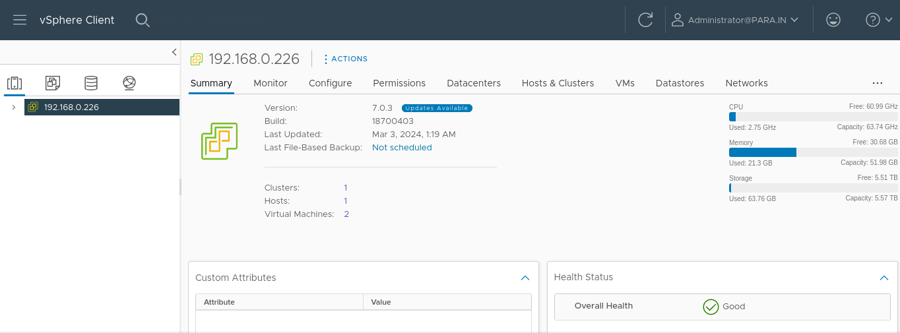
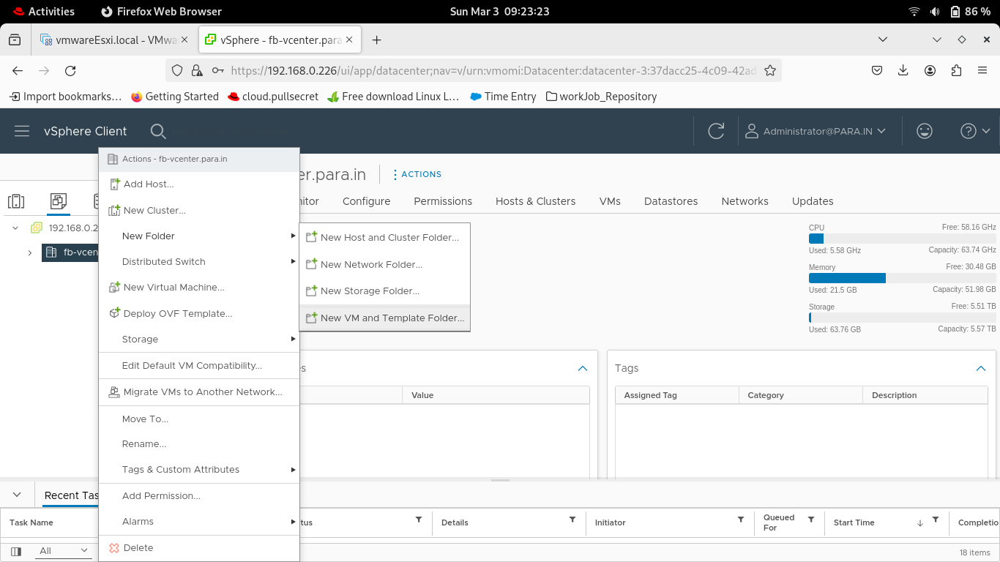
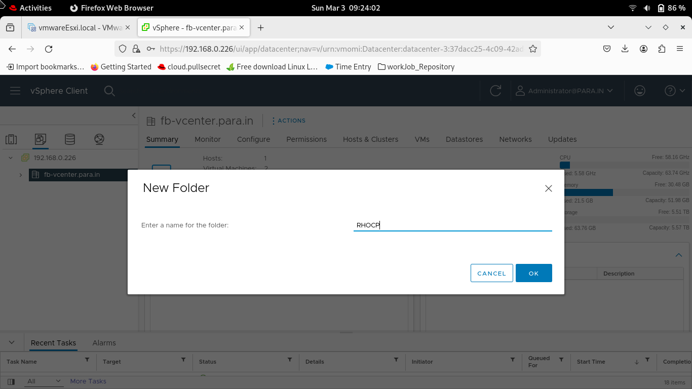
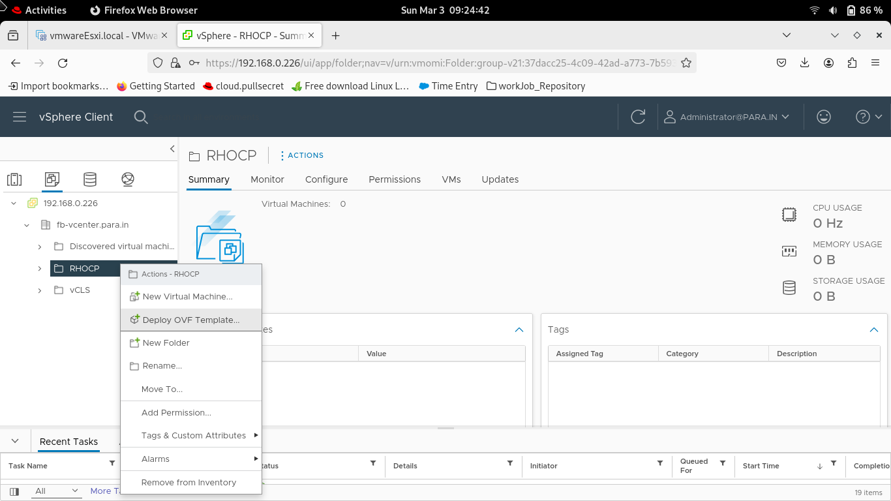
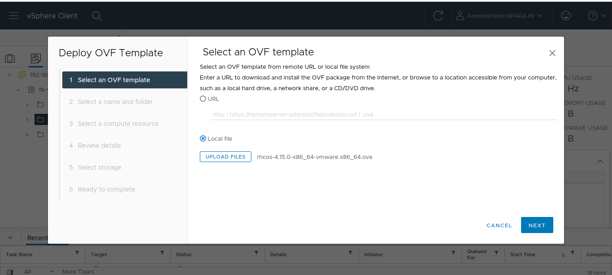
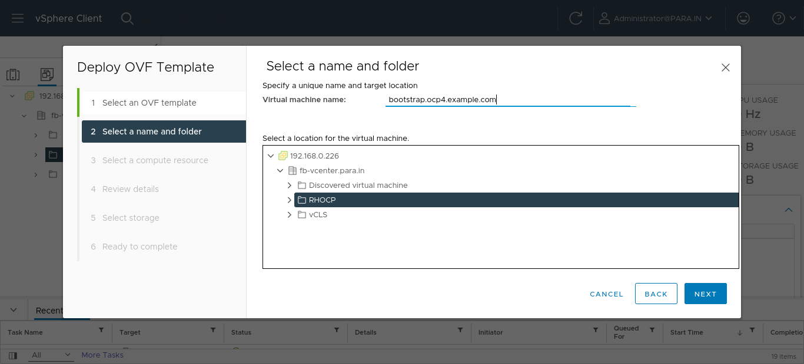
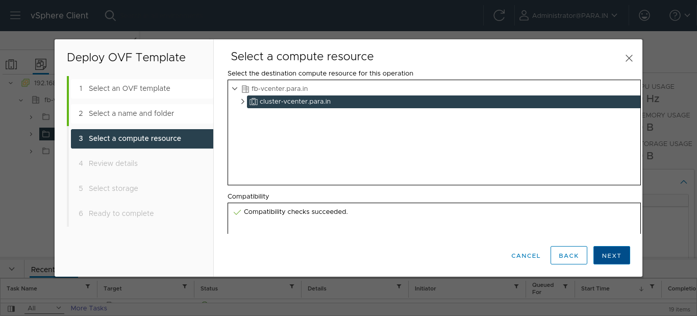
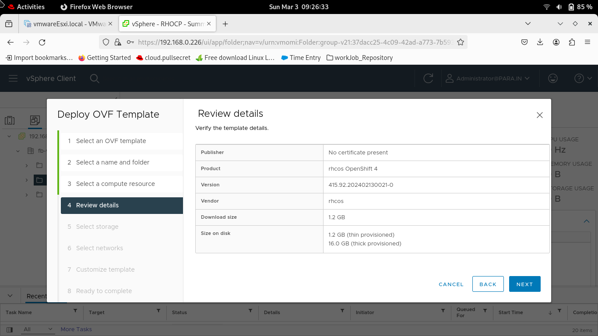
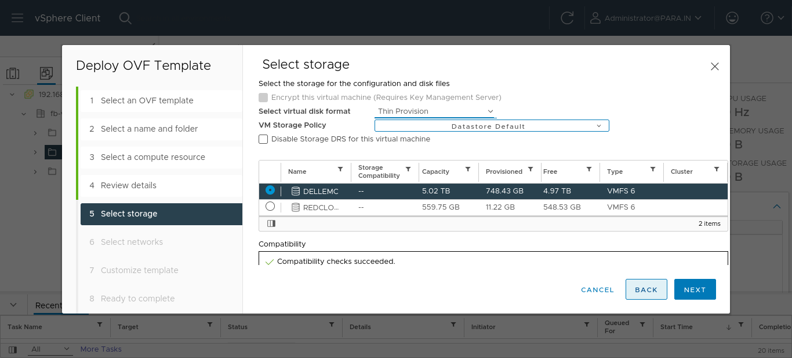
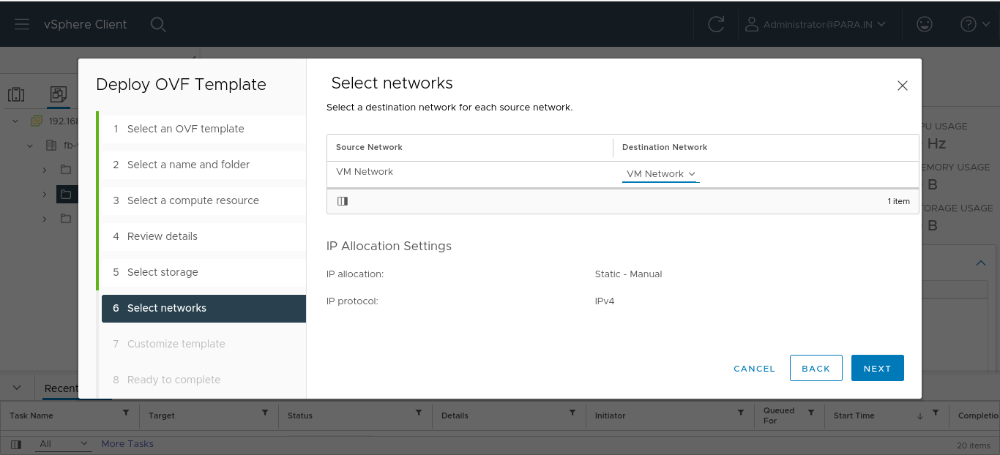
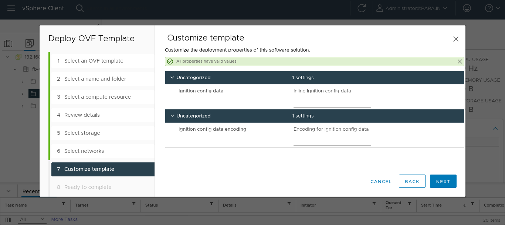
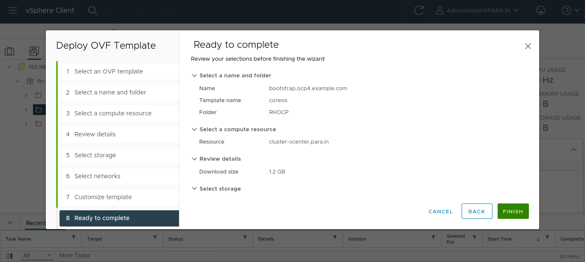
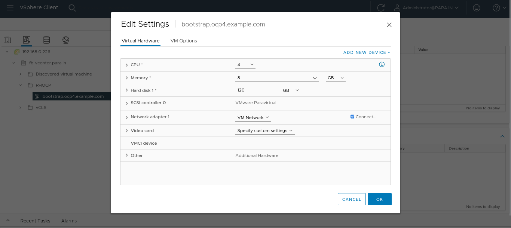
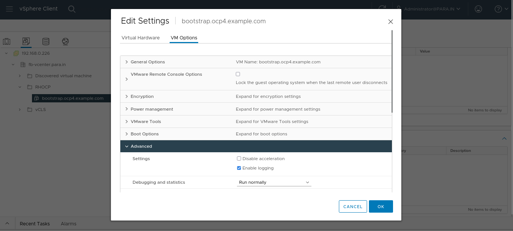
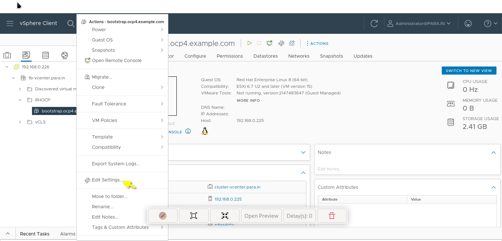
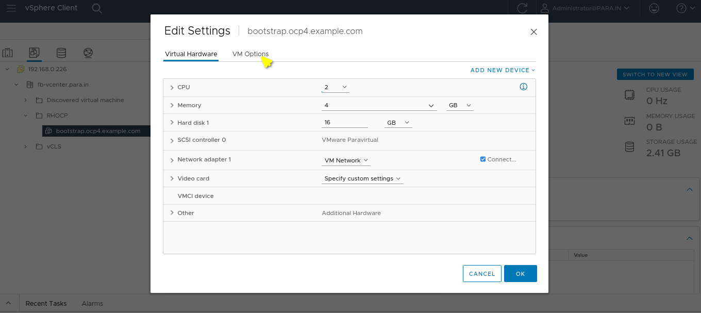
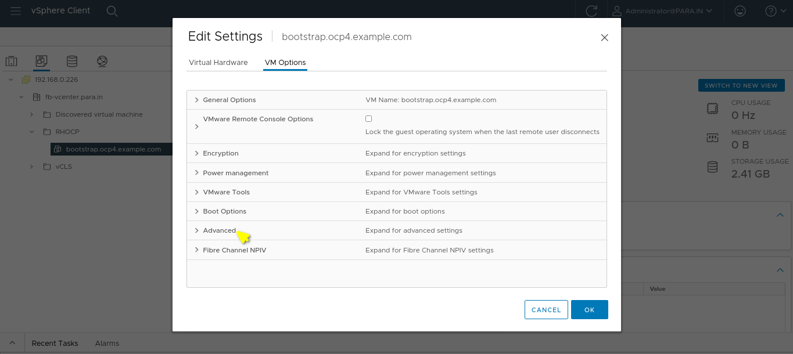
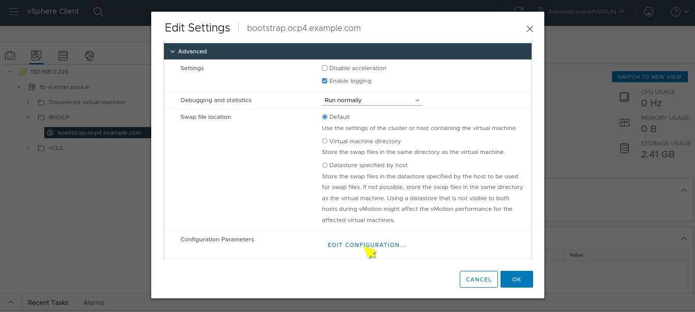
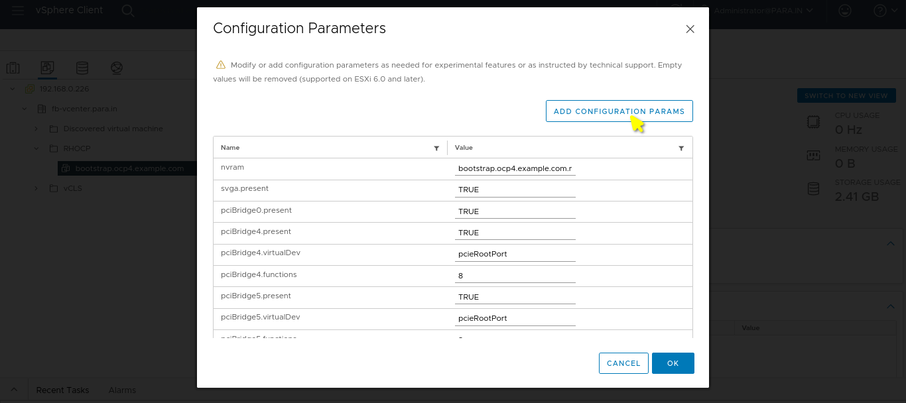
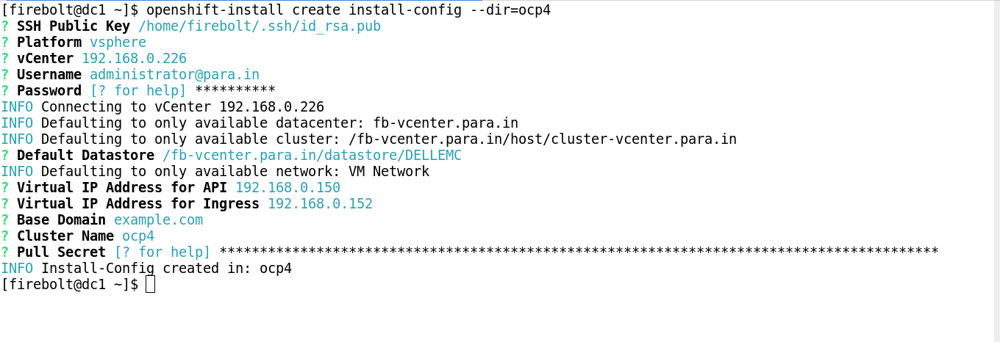

- reboot

## Preparing Masters Node 

As same As bootstrap configuration, change IP and Nodes name accordingly. 

# Openshift 4.15 Bootstrapping

Login to bootstrap node. 

    [root@reg01 ~]# ssh core@192.168.0.197
    Warning: Permanently added '192.168.0.197' (ECDSA) to the list of known hosts.
    Red Hat Enterprise Linux CoreOS 412.86.202308081039-0
      Part of OpenShift 4.15, RHCOS is a Kubernetes native operating system
      managed by the Machine Config Operator (`clusteroperator/machine-config`).
    
    WARNING: Direct SSH access to machines is not recommended; instead,
    make configuration changes via `machineconfig` objects:
      https://docs.openshift.com/container-platform/4.15/architecture/architecture-rhcos.html
    
    ---
    This is the bootstrap node; it will be destroyed when the master is fully up.
    
    The primary services are release-image.service followed by bootkube.service. To watch their status, run e.g.
    
      journalctl -b -f -u release-image.service -u bootkube.service

    [core@boot ~]$  journalctl -b -f -u release-image.service -u bootkube.service
    -- Logs begin at Wed 2024-01-24 19:34:14 UTC. --
    Jan 24 19:34:29 boot.ocp4.example.com systemd[1]: Starting Download the OpenShift Release Image...
    Jan 24 19:34:29 boot.ocp4.example.com release-image-download.sh[1904]: Pulling reg01.ocp4.example.com:8443/ocp4/openshift4@sha256:fcc9920ba10ebb02c69bdd9cd597273260eeec1b22e9ef9986a47f4874a21253...
    Jan 24 19:34:29 boot.ocp4.example.com release-image-download.sh[1977]: 4be070dd54889436046224a7993fea8e507fd4658785912352688456b6359386
    Jan 24 19:34:29 boot.ocp4.example.com systemd[1]: Started Download the OpenShift Release Image.
    Jan 24 19:34:31 boot.ocp4.example.com systemd[1]: Started Bootstrap a Kubernetes cluster.

## Monitor the Bootstrap Process

You can monitor the bootstrap process from the reg01 host at different log levels (debug, error, info)

    [root@reg01 ~]# ~/openshift-install --dir ~/ocp4 wait-for bootstrap-complete --log-level=debug

Once bootstrapping is complete the boot.ocp4.example.com node can be removed

# Openshift Skeleton Deployment

## Wait for installation to complete

    [root@reg01 ~]# ~/openshift-install --dir ~/ocp4 wait-for install-complete

Continue to join the worker nodes to the cluster in a new tab whilst waiting for the above command to complete

Setup 'oc' and 'kubectl' clients on the ocp-svc machine

    [root@reg01 ~]# export KUBECONFIG=~/ocp4/auth/kubeconfig

Test auth by viewing cluster nodes

    [root@reg01 ~]# oc get nodes

## View and approve pending CSRs

View CSRs

    [root@reg01 ~]# oc get csr

Approve all pending CSRs

    [root@reg01 ~]# oc get csr -o go-template='{{range .items}}{{if not .status}}{{.metadata.name}}{{"\n"}}{{end}}{{end}}' | xargs oc adm certificate approve

Wait for kubelet-serving CSRs and approve them too with the same command

    [root@reg01 ~]# oc get csr -o go-template='{{range .items}}{{if not .status}}{{.metadata.name}}{{"\n"}}{{end}}{{end}}' | xargs oc adm certificate approve

## Operator Hub 

Create a imageset-config.yaml file. 

    [root@reg01 ~]# mkdir operators 
    [root@reg01 ~]# cd operators

    [root@reg01 operators]# vim imageset-config.yaml  
    kind: ImageSetConfiguration
    apiVersion: mirror.openshift.io/v1alpha2
    archiveSize: 4                                                      
    storageConfig:                                                      
      registry:
        imageURL: dc1.redprodc1.root.para.in:8443/redhat-catalog/operators                 
        skipTLS: false
    mirror:
      platform:
        channels:
        - name: stable-4.15                                             
          type: ocp
        graph: true                                                     
      operators:
      - catalog: registry.redhat.io/redhat/redhat-operator-index:v4.15  
        packages:
        - name: advanced-cluster-management
          channels:
          - name: release-2.9
        - name: ansible-automation-platform-operator
          channels:
          - name: stable-2.4-cluster-scoped 
        - name: ansible-cloud-addons-operator
          channels:
          - name: stable-2.4-cluster-scoped
        - name: cluster-observability-operator
          channels:
          - name: development
        - name: cluster-kube-descheduler-operator
          channels:
          - name: stable 
        - name: file-integrity-operator
          channels:
          - name: stable  
        - name: kiali-ossm
          channels:
          - name: stable  
        - name: klusterlet-product
          channels:
          - name: stable-2.4  
        - name: kubevirt-hyperconverged
          channels:
          - name: stable  
        - name: local-storage-operator
          channels:
          - name: stable  
        - name: loki-operator
          channels:
          - name: stable-5.8  
        - name: mcg-operator
          channels:
          - name: stable-4.14  
        - name: machine-deletion-remediation
          channels:
          - name: stable  
        - name: node-healthcheck-operator 
          channels:
          - name: stable  
        - name: node-maintenance-operator
          channels:
          - name: stable  
        - name: node-observability-operator
          channels:
          - name: alpha 
        - name: ocs-operator
          channels:
          - name: stable-4.14 
        - name: ocs-client-operator
          channels:
          - name: stable-4.14
        - name: openshift-cert-manager-operator
          channels:
          - name: stable-v1  
        - name: openshift-gitops-operator
          channels:
          - name: latest  
        - name: openshift-pipelines-operator-rh
          channels:
          - name: latest  
        - name: quay-bridge-operator
          channels:
          - name: stable-3.10  
        - name: quay-operator
          channels:
          - name: stable-3.10  
        - name: redhat-oadp-operator
          channels:
          - name: stable-1.3  
        - name: rhbk-operator
          channels:
          - name: stable-v22  
        - name: sandboxed-containers-operator
          channels:
          - name: stable  
        - name: servicemeshoperator
          channels:
          - name: stable  
        - name: submariner
          channels:
          - name: stable-0.16  
        - name: vertical-pod-autoscaler
          channels:
          - name: stable  
        - name: web-terminal
          channels:
          - name: fast
        - name: jaeger-product
          channels:
          - name: stable  firebolt
    
      additionalImages:
      - name: registry.redhat.io/ubi9/ubi:latest                        
      helm: {}

Pushing operators to Quay Registry. 

    [root@reg01 ~]# oc-mirror --config=imageset-config.yaml docker://reg01.ocp4.example.com:8443 
    
    [root@dc1 operator-1]# ls
    imageset-config.yaml  oc-mirror-workspace

Checkout the operators are pushed. 

    [root@dc1 operator-1]# tree oc-mirror-workspace/
    oc-mirror-workspace/
    ├── publish
    └── results-1709345984
        ├── catalogSource-cs-redhat-operator-index.yaml
        ├── charts
        ├── imageContentSourcePolicy.yaml
        ├── mapping.txt
        └── release-signatures
            └── signature-sha256-0da6316466d60a3a.json    
    4 directories, 4 files

Apply Operator index yaml. 

    [root@dc1 operator-1]# oc apply -f oc-mirror-workspace/results-1709345984/catalogSource-cs-redhat-operator-index.yaml
     
    [root@dc1 operator-1]# oc apply -f oc-mirror-workspace/results-1709345984/imageContentSourcePolicy.yaml 
    
## Disabling the default OperatorHub catalog sources

Disable the sources for the default catalogs by adding disableAllDefaultSources: true to the OperatorHub object:

    [root@reg01 ~]# oc patch OperatorHub cluster --type json -p '[{"op": "add", "path": "/spec/disableAllDefaultSources", "value": true}]'

## Removing the kubeadmin user

After you define an identity provider and create a new cluster-admin user, you can remove the kubeadmin to improve cluster security.

> **[!WARNING]**
> If you follow this procedure before another user is a cluster-admin, then OpenShift Container Platform must be reinstalled. It is not possible to undo this command.

### Prerequisites

* You must have configured at least one identity provider.
* You must have added the cluster-admin role to a user.
* You must be logged in as an administrator.

Retrieve the kubeadmin secret details as shown below
    
    [root@reg01 ~]# oc get secrets kubeadmin -n kube-system
    NAME        TYPE     DATA   AGE
    kubeadmin   Opaque   1      97d

Remove the kubeadmin secret as shown below

    [root@reg01 ~]# oc delete secrets kubeadmin -n kube-system
    secret "kubeadmin" deleted

Verify if the kubeadmin secret no more exists as shown below
    
    [root@reg01 ~]# oc get secrets kubeadmin -n kube-system
    Error from server (NotFound): secrets "kubeadmin" not found
